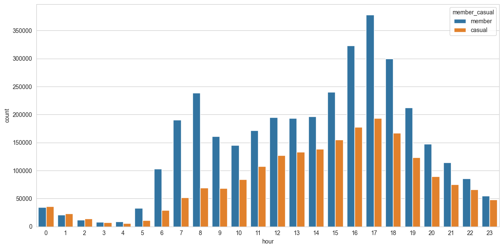

## Cyclistic

### Introducción

Esquivel Guillén Alejandra Gpe. 

Caso de estudio de propuesto en el curso <a href="https://www.coursera.org/professional-certificates/google-data-analytics"> Google Data Analytics Professional Certificate</a>

Desarrollado en el lenguaje de programación Python

Informe elaborado en markdown

 

### Programa de bicicletas compartidas de Chicago

#### Objetivo del análisis
1. Maximizar la cantidad de membresías anuales
2. Diferenciar a los ciclicstas ocacionales y a los miembros anuales
3. Diseñar una estrategia que convierta a los ciclistas ocacionales en miembros anuales

#### Preparación
1. Los datos usados se obtuvieron de <a href="https://divvy-tripdata.s3.amazonaws.com/index.html"> divvy-tripdata</a>.
2. El periodo de análsis comprende del Enero 2023 a Diciembre 2023.
3. Cada archivo contiene la información correspondiente a un mes.
4. Los datos están estructurados.
5. Los datos están bajo la licencia <a href="https://divvybikes.com/data-license-agreement"> Motivate International Inc </a>

 

### Procesamiento
1. Se explora cada archivo CSV para válidar que la información sea consistente, es decir, que contenga el mismo número de campos, el mismo tipo de información y que los campos contengan el mismo nombre en todos los archivos.
2. Al verificar la información, se crea un único archivo CSV con la información de los 12 meses.
3. Iniciando con el procesamiento de datos, se calculan los porcentajes de valores nulos, con un resultado de entre 15 y 16% para los campos de **station_name** y **station_id** y un 0.1% para valores de **lat** y **lng**. Al análizar los resultados podemos deducir que los valores faltantes para los campos **station_name** y **station_id** no resultan de interes, es por ello que eliminamos dichos campos.

4. Se eliminan los valores nulos para los campos **lat** y **lng**.
5. Se eliminan los valores duplicados.
6. Convertir los campos **started_at** y **ended_at** a **datetime64**.
7. Creación de las columnas **hora**, **día** y **mes**.
8. Creación de la columna **ride_length** la cual contiene la diferencia en minutos entre las columnas **started_at** y **ended_at**.
9. Creación del campo **distance** en **kms**, a partir de la longitud de inicio y destino. Se aplica el teorema de pitágoras dando como resultado grados, para convertirlo a kms se multiplica por 111.
Nota: Es posible aplica el método Haversine o aplicando el paquete geopy.distance.
10. Los valores negativos y menores que uno en el campo **ride_length** se descartan ya que puede deberse a u falso comienzo de uso por parte del usuario.

 

### Análisis y visualuzaciones
1. Los miembros ocasionales tienden a duran más tiempo de viaje en sus recorridos que los miembros anuales.
El tiempo de viaje de los miembros anuales varía de entre 1 a 2 días, mientras que el tiempo de viaje para los miembros ocasionales varía de entre 1 a 10 días. Como se muentra en el siguiente gráfico.

2. En el siguiente gráfico se muestra el total de viajes durante un año. Los miembros anuales rondan entre los **3.5M** de viajes al año, y los miembros ocasionales ronda entre los **2M** de viajes.

3. El comportamiento de los miembros anuales y ocasionales tiende a ser similar y a aumentar en la temporada de verano.

4. Los días de mayor uso son para los miembros anuales va de **Martes** a **Miércoles** lo cuál sobrepasa el medio millón de viajes, mientras que para los usuarios ocasionales el uso aumenta de **Viernes** a **Domingo**.

5. Las horas con mayor uso para los miembros anuales varia en la mañana de **7 AM** a **9 AM** y por la tarde de **4 PM** a **7 PM**, lo cuál nos indica que destinan el uso para transportarse a la oficina. Mientras que la tendencia de uso de los miembros ocasionales se dispara a partir de las **10 AM** este uso tiende a umentar por las tardes y tiende a bajar alrededor de las **9 PM**.

6. La mayor concentración de preferencia de uso para miembros anuales son las bicicletas clasicas, seguido de biciletas electricas, mientras que la preferencia de uso para los miembros casuales son las bicicletas electricas, seguido por las bicicletas casuales.

#### Conclusiones
De las gráficas previas se puede deducir que:
1. Los miembros anuales hacen mayor uso entre los días laborales y las horas más concurridas coinciden con las entradas y salidas de oficinas, mientras que la tendencia de los miembrios ocasionales se refleja en el uso de las biciletas los fines de semana con un horario más extenso, es decir, de **10 AM** a **9 PM**.
2. Los meses de mayor uso son entre **Mayo** y **Septiembre**, que son los meses del verana en EEUU.

 

#### Recomendaciones
A fin de atraer a los clientes ocasionales, como miembros anuales, es posible:
1. Ofrecer una membresia anual para uso de biciclietas los fines de semana.
2. Ofrecer promociones exclusivas que reflejen el ahorro economico al adquirir la membresia anual para uso de fines de semana.
3. A manera de ir realizando el cambio de membresia de manera eventual, es posible ofrecer recompensas a los usuarios ocasionales, tanto en viajes, como en la posibilidad de adquirir la membresia anual regular o la menbresia anual para uso de fines de semana.
4. Ofrecer una membresia de verano, que abarque los meses más concurridos.